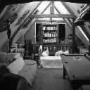
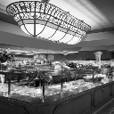
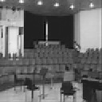
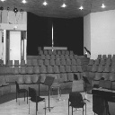
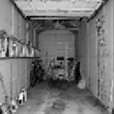
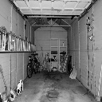

# Problem statement : Develop a neural net to convert RGB image into a grayscale image.

Steps followed :
Data preparation : 
  1. There are 67 different types of objects. Took 20 images from each set
  2. Created 2 different directories, 1 for colored and the other for gray scale. Gray scale image was produced from opencv.
  3. Resized the image to 128 * 128
  4. Normalized the image by dividing by 255 as the max value for each pixel is 255
  5. Test train split of 70:30
  
Neural Network Model 
  1. Used a simple convolutional autoencoder.
  2. Activation function used : Relu. No activation function for the last layer.
  3. Encoder: Conv layer followed by a max pool layer. Decoder: UpSampling layer followed by conv layer.
  4. Optimizer: Adam, as it is the fastest.
  5. Loss: Mean squared error
  6. Epochs : 10
  7. Batch size : 32

Steps to run
  1. Download the image data from the mentioned link, or any other dataset can be used.
  2. Place the dataset and the Grayscale_Converter.ipynb in the same directory.
  3. Create directories : data/gray_images, data/color_images, data/output
  
  
To see the generated images check Readme.ipynb

Data source: http://web.mit.edu/torralba/www/indoor.html?source=post_page--------------------------- 

This is a 2.4 GB data set. Choose this dataset as it has wide variety of images so the neural network will generalize better to different types of images

# Some of the sample images. Left is generated through the network and the right one is generated through open cv

<table><tr><td></td><td></td></tr></table>
<table><tr><td></td><td></td></tr></table>
<table><tr><td></td><td></td></tr></table>
<table><tr><td></td><td></td></tr></table>
<table><tr><td></td><td></td></tr></table>
<table><tr><td></td><td></td></tr></table>
